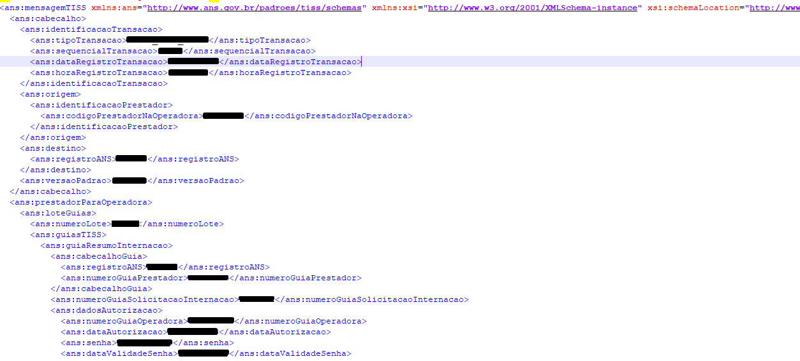

<h1 align="center">Alterador de Guias TISS</h1>

<p align="center">A ideia inicial desse projeto nasceu da necessidade de uma ferramenta capaz de realizar manutenções/alterações de 
dados eletrônicos em guias médicas (arquivos XML) no <b>padrão TISS</b> definido pela ANS, com propósito 
de otimizar o tempo gasto para essa tarefa que até então em meu trabalho era feita de forma manual através de editores de texto como 
++Notepad, bloco de notas, etc.</p>

<p align="center">
    <a href="#-projeto">Projeto</a>&nbsp;&nbsp;&nbsp;|&nbsp;&nbsp;&nbsp;
    <a href="#-funcionalidades">Funcionalidades</a>&nbsp;&nbsp;&nbsp;|&nbsp;&nbsp;&nbsp;
    <a href="#-tecnologias">Tecnologias</a>&nbsp;&nbsp;&nbsp;|&nbsp;&nbsp;&nbsp;
    <a href="#-licença">Licença</a>&nbsp;&nbsp;&nbsp;
</p>

_Guia TISS_


## Projeto

<p align="justify">Realizar manutenção de dados eletrônicos em guias médicas no padrão TISS. Dentre os dados a serem
alterados estão: </p>

* Código de procedimento;
* Tipo de tabela;
* Unidade de medida;
* Grau de participação;
* Código de despesa;
* Valor unitário;
* Valor total;

## Funcionalidades

### Leitura de críticas

<p align="justify">Para realização das alterações, é necessário a entrada dos dados a serem alterados em tabelas
que serão lidas pelo software.</p>

Foi criado uma [planilha em formato XLSX](Planilha de Críticas.xlsx) no repositório contendo tabelas padronizadas 
para duas categorias de alterações.

<p align="justify">Abaixo estão as colunas das tabelas que representam os dados que serão alterados:</p>

> Alterações de dados:

| Número da guia | Código de procedimento (atual) | Código de procedimento (novo) | Tipo de tabela (atual) | Tipo de tabela (nova) | Grau de participação (atual) | Grau de participação (novo) | Código de despesa (atual) | Código de despesa (novo) | Unidade de Medida (atual) | Unidade de Medida (novo) |
|----------------|--------------------------------|-------------------------------|------------------------|-----------------------|------------------------------|-----------------------------|---------------------------|--------------------------|---------------------------|--------------------------|

<br>

> Alterações de valores:

| Número da guia | Código de procedimento | Valor unitário (atual) | Valor unitário (novo) |
|----------------|------------------------|------------------------|-----------------------|


<p align="justify">Em ambas tabelas, a coluna número da guia pode ser preenchida para especificar uma guia a ser realizada alteração.<br>
Quando vazia, irá realizar alteração em todas guias da conta para o procedimento especificado.<br><br>
Para informações mais técnicas sobre a leitura das tabelas recomendo a visualização da classe responsável: </p>

```Python
class Tabela
```

